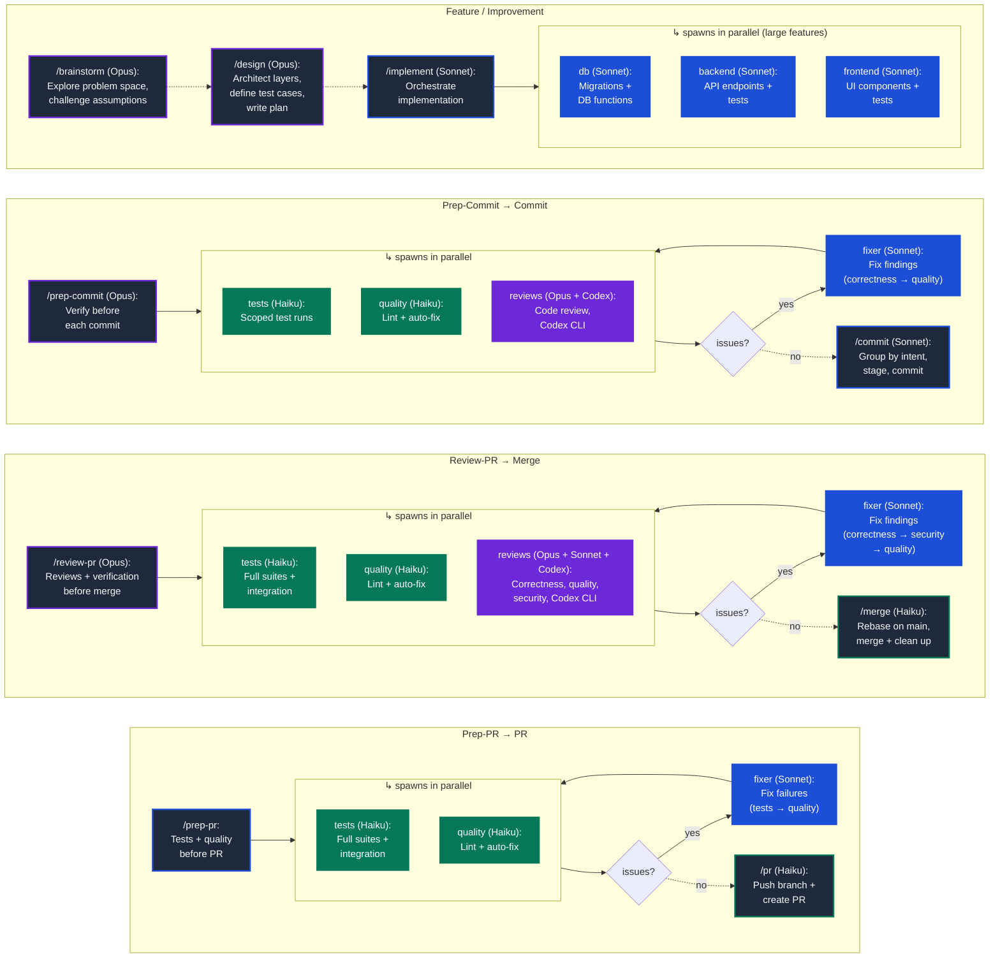

# ccupa

Personal [Claude Code](https://claude.ai/code) plugin accumulated over ~6 months of recreational use. Most of it is simple and likely part of hundreds of thousands of similar plugins; a few less common parts called out below.

## Philosophy

Enable Claude Code to independently and quickly deliver high-quality code, so the user can spend as little time as possible.

### Test-driven development

For features and bug fixes alike, define desired outcomes clearly so Claude can (a) author tests verifying those outcomes and (b) iterate on implementation until verified.

**Define → Test → Implement** ordering is enforced in `/design`, `/implement`, and `/bug`. Tests are written against interfaces before implementation exists — this prevents bias toward verifying "how it was written" rather than "what it should do." Test cases are defined during design (Phase 2 of `/design`), carried into the implementation plan, and executed test-first by `/implement`.

**Stash-based bug fix proof** (`/bug`, `/prep-commit --bugfix`): stash the fix → run tests → they must fail (proving the bug is reproducible) → pop the stash → run tests → they must pass (proving the fix works). If the fail step doesn't fail, the test doesn't actually catch the bug — stop and revise.

### Intentional context management

Use agents to (a) reduce context usage of the main session and (b) limit confirmation bias.

**Clean-slate reviews.** Code reviews in `/prep-commit` and `/review-pr` run in separate agent sessions with no exposure to the implementation reasoning. The reviewer sees `git diff`, not the conversation that produced it.

**Three-reviewer pattern** (`/review-pr`): correctness, quality, and security — each reviewer goes deep on one concern instead of shallow on all three. They run in parallel (wall-clock time equals one review), produce independent perspectives, and findings are deduplicated before a single fixer agent addresses them in one pass.

### Parallelize where possible

Reduce wall-clock time by running independent workstreams simultaneously.

- `/prep-commit` spawns up to **6 parallel agents**: backend tests, frontend tests, backend quality, frontend quality, code reviewer, and Codex reviewer
- `/prep-pr` spawns up to **5 parallel agents**: 2 test runners + 1 integration tests + 2 quality checkers
- `/review-pr` spawns up to **8 parallel agents**: 3 test runners + 2 quality checkers + 3 specialized reviewers (including Codex)
- `/implement` spawns up to **3 parallel agents** (DB, backend, frontend) for features with independent layers

Conditional skipping avoids wasted work: quality agents are skipped if `/prep-commit` already ran them with no code changes since; the security reviewer only spawns when changes touch auth, API, DB, or user input handling; test/quality agents are skipped entirely for unchanged sides.

### Unattended execution

Agents that spawn sub-agents need tool permissions pre-configured in `.claude/settings.local.json` — otherwise they block waiting for user approval. The permissions skill handles this: `/setup` bootstraps permissions during onboarding and preflight checks run before every agent-heavy command. `/learn` reflects on the full session — including scanning for patterns approved at runtime — and proposes improvements to permissions, conventions, and workflows.

## Workflow

Solid arrows are auto-invoked by the source command; dashed arrows require explicit user invocation.



## Workflow commands

| Command | Purpose |
|---------|---------|
| `/setup` | Onboard a project: configure permissions, bootstrap settings |
| `/brainstorm` | Explore problem space, challenge assumptions, recommend direction |
| `/design` | Architect layer-by-layer (storage → backend → frontend), define test cases |
| `/implement` | Execute plan — sequential or parallel agents, define → test → implement order |
| `/bug` | Investigate, write regression test, fix, prove fix works |
| `/prep-commit` | Parallel agents: scoped tests, quality checks, code review |
| `/commit` | Stage and commit per git conventions |
| `/prep-pr` | Full test suites + quality checks (gates `/pr`) |
| `/pr` | Push branch, create PR via `gh` with structured body |
| `/review-pr` | Code reviews + tests/quality baseline + fix loop; post PR comment (gates `/merge`) |
| `/merge` | Rebase on main, merge, clean up |
| `/sync-main` | Pull latest main, delete merged local branches |
| `/push` | Push main to all configured remotes |
| `/learn` | Session reflection: review permissions, corrections, patterns; propose improvements |

## Convention skills

| Skill | Purpose |
|-------|---------|
| **coding-standards** | Python/FastAPI and React/TypeScript patterns, testing standards |
| **db-conventions** | Migration-first workflow, RPC functions, Supabase patterns |
| **git-conventions** | Commit format, branch naming, PR structure |
| **deployment** | Local dev setup and Digital Ocean production deployment |
| **permissions** | Preflight checks before agents, post-session review of runtime approvals |

## Installation

Clone this repository and add it as a Claude Code plugin:

```bash
claude mcp add-json ccupa '{"type":"local","path":"/path/to/ccupa"}'
```

Or add the plugin path in your Claude Code settings.

## License

[MIT](LICENSE)
